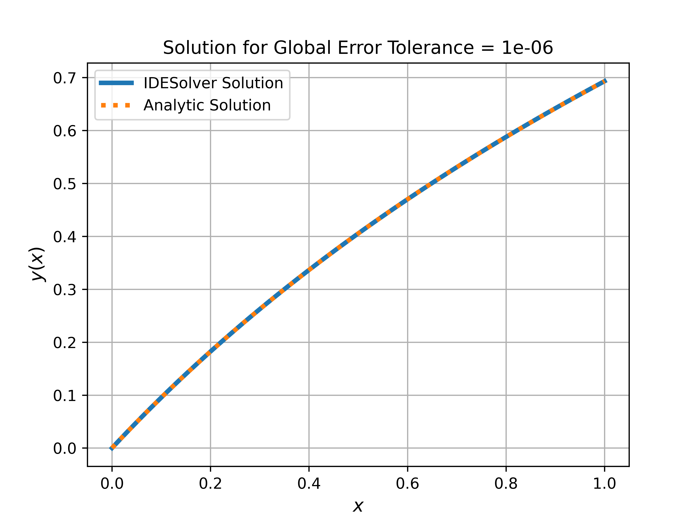
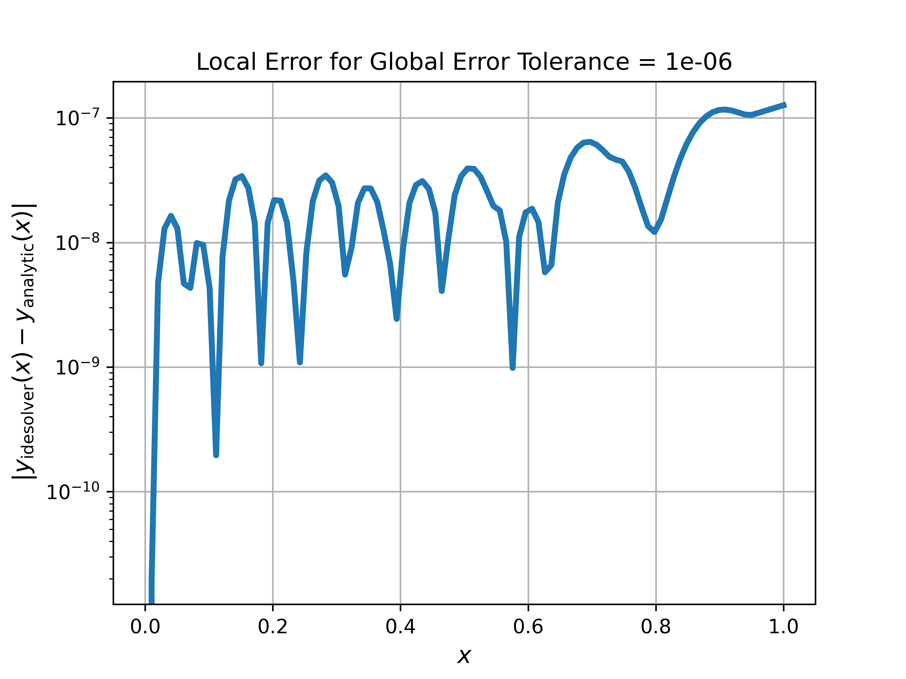

Suppose we want to solve the integro-differential equation (IDE)

$$
\begin{aligned}
    \frac{dy}{dx} & = y(x) - \frac{x}{2} + \frac{1}{1 + x} - \ln(1 + x) + \frac{1}{\left(\ln(2)\right)^2} \int_0^1 \frac{x}{1 + s} \, y(s) \, ds, \\
    & x \in [0, 1], \quad y(0) = 0.
\end{aligned}
$$

The analytic solution to this IDE is $y(x) = \ln(1 + x)$.
We'll find a numerical solution using IDESolver and compare it to the analytic solution.

The first thing we need to do is install IDESolver.
If you're using `pip`, that will be something like running `python -m pip install idesolver` in your terminal,
ideally with a virtual environment activated.

Now we can create an instance of [`IDESolver`][idesolver.IDESolver],
passing it information about the IDE that we want to solve.
The format is

$$
\begin{aligned}
   \frac{dy}{dx} & = c(y, x) + d(x) \int_{\alpha(x)}^{\beta(x)} k(x, s) \, F( y(s) ) \, ds, \\
   & x \in [a, b], \quad y(a) = y_0.
\end{aligned}
$$

so we have

$$
\begin{aligned}
    a &= 0 \\
    b &= 1 \\
    y(a) &= 0 \\ \\
    c(x, y) &= y(x) - \frac{x}{2} + \frac{1}{1 + x} - \ln(1 + x) \\
    d(x) &= \frac{1}{\left(\ln(2)\right)^2} \\
    k(x, s) &= \frac{x}{1 + s} \\
    f(s) &= y(s) \\ \\
    \alpha(x) &= 0 \\
    \beta(x) &= 1.
\end{aligned}
$$

In code, that looks like (using `lambda` functions for compactness):

```python
import numpy as np

from idesolver import IDESolver

solver = IDESolver(
    x=np.linspace(0, 1, 100),
    y_0=0,
    c=lambda x, y: y - (0.5 * x) + (1 / (1 + x)) - np.log(1 + x),
    d=lambda x: 1 / (np.log(2)) ** 2,
    k=lambda x, s: x / (1 + s),
    f=lambda y: y,
    lower_bound=lambda x: 0,
    upper_bound=lambda x: 1,
)
```


To run the solver, we call the `solve()` method:

```python
solver.solve()

solver.x  # whatever we passed in for x
solver.y  # the solution y(x)
```


The default global error tolerance is $10^{-6}$, with no maximum number of iterations.
For this IDE the algorithm converges in 40 iterations,
resulting in a solution that closely approximates the analytic solution, as seen below.

```python
import matplotlib.pyplot as plt

fig = plt.figure(dpi=600)
ax = fig.add_subplot(111)

exact = np.log(1 + solver.x)

ax.plot(solver.x, solver.y, label="IDESolver Solution", linestyle="-", linewidth=3)
ax.plot(solver.x, exact, label="Analytic Solution", linestyle=":", linewidth=3)

ax.legend(loc="best")
ax.grid(True)

ax.set_title(f"Solution for Global Error Tolerance = {solver.global_error_tolerance}")
ax.set_xlabel(r"$x$")
ax.set_ylabel(r"$y(x)$")

plt.show()
```




```python
fig = plt.figure(dpi=600)
ax = fig.add_subplot(111)

error = np.abs(solver.y - exact)

ax.plot(solver.x, error, linewidth=3)

ax.set_yscale("log")
ax.grid(True)

ax.set_title(
    f"Local Error for Global Error Tolerance = {solver.global_error_tolerance}"
)
ax.set_xlabel(r"$x$")
ax.set_ylabel(r"$\left| y_{\mathrm{idesolver}}(x) - y_{\mathrm{analytic}}(x) \right|$")

plt.show()
```


